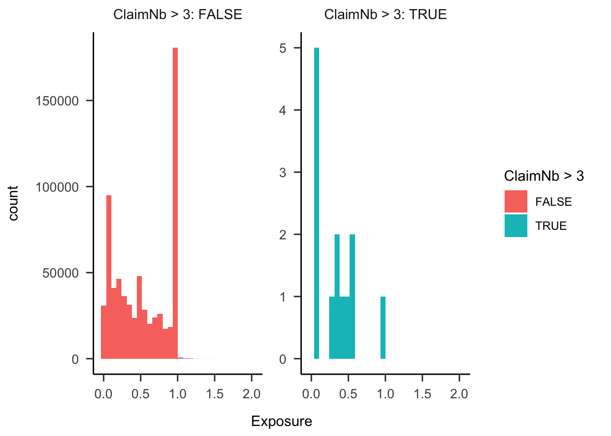
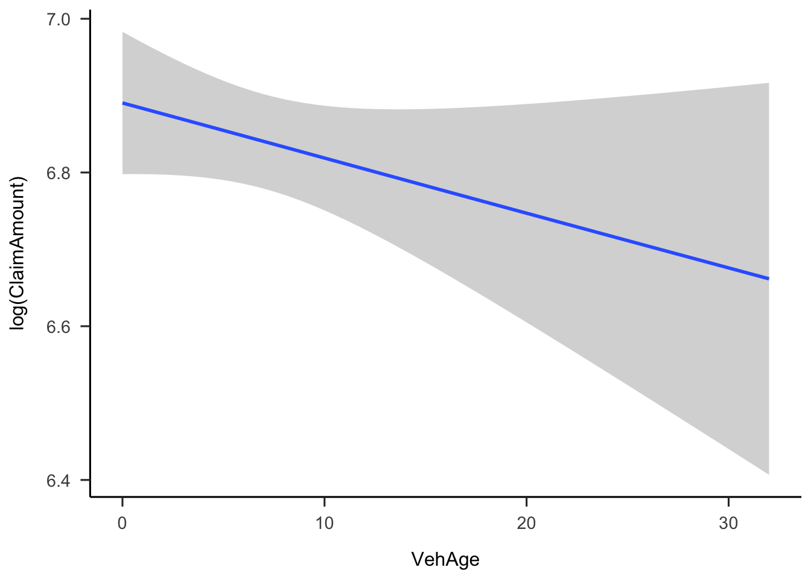

::: {.cell}

```{.r .cell-code}
mtpl2_freq <- read_parquet("./data/freMTPL2freq.parquet")
mtpl2_sev <- read_parquet("./data/freMTPL2sev.parquet")
```
:::


# Datenaufbereitung

Zunächst säubere ich die Daten und versuche eine Zusammenhang zwischen den Daten zu Schadenshäufigkeit und Schadensschwere herzustellen.
Es scheint als gäbe es nicht in allen Fällen eine 1:1-Beziehung zwischen den Daten zu Schadenshäufigkeit und Schadensschwere.
Zunächst gibt es Schadensfälle, zu denen es keine Schadensschwere-Daten gibt.


::: {.cell}

```{.r .cell-code}
dim(mtpl2_freq)
```

::: {.cell-output .cell-output-stdout}
```
[1] 678012     12
```
:::

```{.r .cell-code}
dim(mtpl2_sev)
```

::: {.cell-output .cell-output-stdout}
```
[1] 26639     2
```
:::
:::


Außerdem scheint es Versicherungspolicen zu geben, für die es keine Schadenshäufigkeits- und solche zu denen es keine Schadensschwere-Daten gibt.


::: {.cell}

```{.r .cell-code}
duplicated(mtpl2_freq$IDpol) |> sum()
```

::: {.cell-output .cell-output-stdout}
```
[1] 0
```
:::

```{.r .cell-code}
sum(!mtpl2_sev$IDpol %in% mtpl2_freq$IDpol[mtpl2_freq$ClaimNb > 0])
```

::: {.cell-output .cell-output-stdout}
```
[1] 195
```
:::

```{.r .cell-code}
sum(!mtpl2_freq$IDpol[mtpl2_freq$ClaimNb > 0] %in% mtpl2_sev$IDpol)
```

::: {.cell-output .cell-output-stdout}
```
[1] 9115
```
:::
:::


Die Schadensschwere-Daten ohne zugehörige -häufigkeit scheinen IDs mit auffällig vielen Schäden zu sein.
Diese IDs erscheinen fragwürdig und ich werde sie in der weiteren Analyse nicht berücksichtigen.


::: {.cell}

```{.r .cell-code}
mtpl2_sev$IDpol[!mtpl2_sev$IDpol %in% mtpl2_freq$IDpol[mtpl2_freq$ClaimNb > 0]] |>
  table()
```

::: {.cell-output .cell-output-stdout}
```

2220367 2227533 2262511 2277846 2282134 2286775 
     24      25      66      23      36      21 
```
:::
:::


Die Schadenshäufigkeits-Daten ohne zugehörige -schwere reichen von nur einem bis zu 11 Schäden.


::: {.cell}

```{.r .cell-code}
mtpl2_freq$ClaimNb[mtpl2_freq$ClaimNb > 0][!mtpl2_freq$IDpol[mtpl2_freq$ClaimNb > 0] %in% mtpl2_sev$IDpol]  |>
  table()
```

::: {.cell-output .cell-output-stdout}
```

   1    2    3    4   11 
8607  485   20    2    1 
```
:::
:::


Möglicherweise handelt es sich hier um Schäden, bei denen keine Forderung gestellt wurde, z.B. weil der Schaden unter der Selbstbeteiligung lag oder durch die Gegenseite reguliert wurde.
Unter dieser Annahme stellt sich für die Modellierung die Frage, ob diese Schäden überhaupt als Schäden in den Häufigkeiten zu berücksichtigen sind.
Entweder man wertet diese Fälle nicht als Schadensmeldung oder man nutzt sie, um die Haftbarkeit der Versicherten zu modellieren (siehe unten).
Für die vorliegende Analyse habe ich mich entschieden, diese Fälle nicht als Schadensmeldung zu werten.


::: {.cell}

```{.r .cell-code}
mtpl2_freq <- mtpl2_freq |>
  filter(ClaimNb == 0 | (ClaimNb > 0 & IDpol %in% mtpl2_sev$IDpol))

mtpl2_sev_nested <- mtpl2_sev |>
  group_by(IDpol) |>
  summarize(ClaimAmount = list(ClaimAmount))

mtpl2 <- left_join(mtpl2_freq, mtpl2_sev_nested, by = "IDpol") |>
  label_variables(
    IDpol = "Policennummer"
    , ClaimNb = "Schadenanzahl"
    , Exposure = "Vertragsdauer [Jahre]"
    , Area = "Meldegebiet"
    , VehPower = "Motorleistung"
    , VehAge = "Fahrzeugalter"
    , DrivAge = "Fahreralter"
    , BonusMalus = "Schadenfreiheitsklasse"
    , VehBrand = "Fahrzeugmarke"
    , VehGas = "Kraftstoffart"
    , Density = "Bevölkerungsdichte"
    , Region = "Region"
    , ClaimAmount = "Schadenhöhe"
  )
```
:::


# Daten exploration

## Schadenhäufigkeit

In dem Datensatz gibt es nur etwa 25.000 Verträge mit einem oder mehr Schadensmeldungen, was etwa 4% der Daten entspricht.


::: {.cell}

```{.r .cell-code}
table(mtpl2$ClaimNb) |>
  as.data.frame() |>
  mutate(
    rel_freq = Freq / sum(Freq)
    , rel_freq2 = c(NA, Freq[-1] / sum(Freq[-1]))
  ) |>
  arrange(desc(Var1)) |>
  mutate(
    cum_sum = cumsum(Freq)
    , cum_rel_freq = cumsum(rel_freq)
  ) |>
  arrange(Var1) |>
  kable()
```

::: {.cell-output-display}

`````{=html}
<table>
 <thead>
  <tr>
   <th style="text-align:left;"> Var1 </th>
   <th style="text-align:right;"> Freq </th>
   <th style="text-align:right;"> rel_freq </th>
   <th style="text-align:right;"> rel_freq2 </th>
   <th style="text-align:right;"> cum_sum </th>
   <th style="text-align:right;"> cum_rel_freq </th>
  </tr>
 </thead>
<tbody>
  <tr>
   <td style="text-align:left;"> 0 </td>
   <td style="text-align:right;"> 643953 </td>
   <td style="text-align:right;"> 0.9627088 </td>
   <td style="text-align:right;"> NA </td>
   <td style="text-align:right;"> 668897 </td>
   <td style="text-align:right;"> 1.0000000 </td>
  </tr>
  <tr>
   <td style="text-align:left;"> 1 </td>
   <td style="text-align:right;"> 23570 </td>
   <td style="text-align:right;"> 0.0352371 </td>
   <td style="text-align:right;"> 0.9449166 </td>
   <td style="text-align:right;"> 24944 </td>
   <td style="text-align:right;"> 0.0372912 </td>
  </tr>
  <tr>
   <td style="text-align:left;"> 2 </td>
   <td style="text-align:right;"> 1299 </td>
   <td style="text-align:right;"> 0.0019420 </td>
   <td style="text-align:right;"> 0.0520767 </td>
   <td style="text-align:right;"> 1374 </td>
   <td style="text-align:right;"> 0.0020541 </td>
  </tr>
  <tr>
   <td style="text-align:left;"> 3 </td>
   <td style="text-align:right;"> 62 </td>
   <td style="text-align:right;"> 0.0000927 </td>
   <td style="text-align:right;"> 0.0024856 </td>
   <td style="text-align:right;"> 75 </td>
   <td style="text-align:right;"> 0.0001121 </td>
  </tr>
  <tr>
   <td style="text-align:left;"> 4 </td>
   <td style="text-align:right;"> 5 </td>
   <td style="text-align:right;"> 0.0000075 </td>
   <td style="text-align:right;"> 0.0002004 </td>
   <td style="text-align:right;"> 13 </td>
   <td style="text-align:right;"> 0.0000194 </td>
  </tr>
  <tr>
   <td style="text-align:left;"> 5 </td>
   <td style="text-align:right;"> 2 </td>
   <td style="text-align:right;"> 0.0000030 </td>
   <td style="text-align:right;"> 0.0000802 </td>
   <td style="text-align:right;"> 8 </td>
   <td style="text-align:right;"> 0.0000120 </td>
  </tr>
  <tr>
   <td style="text-align:left;"> 6 </td>
   <td style="text-align:right;"> 1 </td>
   <td style="text-align:right;"> 0.0000015 </td>
   <td style="text-align:right;"> 0.0000401 </td>
   <td style="text-align:right;"> 6 </td>
   <td style="text-align:right;"> 0.0000090 </td>
  </tr>
  <tr>
   <td style="text-align:left;"> 8 </td>
   <td style="text-align:right;"> 1 </td>
   <td style="text-align:right;"> 0.0000015 </td>
   <td style="text-align:right;"> 0.0000401 </td>
   <td style="text-align:right;"> 5 </td>
   <td style="text-align:right;"> 0.0000075 </td>
  </tr>
  <tr>
   <td style="text-align:left;"> 9 </td>
   <td style="text-align:right;"> 1 </td>
   <td style="text-align:right;"> 0.0000015 </td>
   <td style="text-align:right;"> 0.0000401 </td>
   <td style="text-align:right;"> 4 </td>
   <td style="text-align:right;"> 0.0000060 </td>
  </tr>
  <tr>
   <td style="text-align:left;"> 11 </td>
   <td style="text-align:right;"> 2 </td>
   <td style="text-align:right;"> 0.0000030 </td>
   <td style="text-align:right;"> 0.0000802 </td>
   <td style="text-align:right;"> 3 </td>
   <td style="text-align:right;"> 0.0000045 </td>
  </tr>
  <tr>
   <td style="text-align:left;"> 16 </td>
   <td style="text-align:right;"> 1 </td>
   <td style="text-align:right;"> 0.0000015 </td>
   <td style="text-align:right;"> 0.0000401 </td>
   <td style="text-align:right;"> 1 </td>
   <td style="text-align:right;"> 0.0000015 </td>
  </tr>
</tbody>
</table>

`````

:::
:::


Es ist auffällig, dass es einige wenige Verträge mit sehr vielen Schäden innerhalb kurzer Vertragslaufzeit gibt.
Sollten dies korrekte Daten sein, würde ich vermuten, dass in der Praxis ein Versicherer in solchen Fällen frühzeitig von seinem Sonderkündigungsrecht gebrauch machen könnte (und vermutlich auch sollte).


::: {.cell}

```{.r .cell-code}
filter(mtpl2, ClaimNb > 3) |>
  select(c("IDpol", "Exposure", "ClaimNb", "ClaimAmount")) |>
  arrange(ClaimNb) |>
  unlabel() |>
  kable()
```

::: {.cell-output-display}

`````{=html}
<table>
 <thead>
  <tr>
   <th style="text-align:left;"> IDpol </th>
   <th style="text-align:right;"> Exposure </th>
   <th style="text-align:right;"> ClaimNb </th>
   <th style="text-align:left;"> ClaimAmount </th>
  </tr>
 </thead>
<tbody>
  <tr>
   <td style="text-align:left;"> 54009 </td>
   <td style="text-align:right;"> 0.56 </td>
   <td style="text-align:right;"> 4 </td>
   <td style="text-align:left;"> 438.54, 1128.12, 2187.66, 1128.12 </td>
  </tr>
  <tr>
   <td style="text-align:left;"> 3016883 </td>
   <td style="text-align:right;"> 0.27 </td>
   <td style="text-align:right;"> 4 </td>
   <td style="text-align:left;"> 178.62, 3376.22, 212.89, 579.14 </td>
  </tr>
  <tr>
   <td style="text-align:left;"> 4031494 </td>
   <td style="text-align:right;"> 0.10 </td>
   <td style="text-align:right;"> 4 </td>
   <td style="text-align:left;"> 1031.00, 1204.00, 2229.81, 1204.00 </td>
  </tr>
  <tr>
   <td style="text-align:left;"> 6006882 </td>
   <td style="text-align:right;"> 0.49 </td>
   <td style="text-align:right;"> 4 </td>
   <td style="text-align:left;"> 7000.00, 1190.95, 7490.00, 2924.47 </td>
  </tr>
  <tr>
   <td style="text-align:left;"> 6059824 </td>
   <td style="text-align:right;"> 0.57 </td>
   <td style="text-align:right;"> 4 </td>
   <td style="text-align:left;"> 1204.00, 1228.08, 7490.00, 644.14 </td>
  </tr>
  <tr>
   <td style="text-align:left;"> 93954 </td>
   <td style="text-align:right;"> 1.00 </td>
   <td style="text-align:right;"> 5 </td>
   <td style="text-align:left;"> 1128.12, 1128.12, 1128.12, 1128.12, 2405.62 </td>
  </tr>
  <tr>
   <td style="text-align:left;"> 2277762 </td>
   <td style="text-align:right;"> 0.08 </td>
   <td style="text-align:right;"> 5 </td>
   <td style="text-align:left;"> 1500, 23000, 1172, 1500, 1500 </td>
  </tr>
  <tr>
   <td style="text-align:left;"> 2216294 </td>
   <td style="text-align:right;"> 0.33 </td>
   <td style="text-align:right;"> 6 </td>
   <td style="text-align:left;"> 5046.63, 1350.28, 389.14, 1227.54, 813.37, 826.64 </td>
  </tr>
  <tr>
   <td style="text-align:left;"> 2239279 </td>
   <td style="text-align:right;"> 0.41 </td>
   <td style="text-align:right;"> 8 </td>
   <td style="text-align:left;"> 3500.00, 5000.00, 38.27, 1482.74, 772.17, 8596.96, 3935.63, 1500.00 </td>
  </tr>
  <tr>
   <td style="text-align:left;"> 2248174 </td>
   <td style="text-align:right;"> 0.08 </td>
   <td style="text-align:right;"> 9 </td>
   <td style="text-align:left;"> 85.51, 3000.00, 5000.00, 1056.00, 1500.00, 2588.38, 1500.00, 1219.92, 2404.85 </td>
  </tr>
  <tr>
   <td style="text-align:left;"> 3253234 </td>
   <td style="text-align:right;"> 0.08 </td>
   <td style="text-align:right;"> 11 </td>
   <td style="text-align:left;"> 8000.00, 5000.00, 1739.82, 1700.00, 1760.00, 1500.00, 742.86, 1500.00, 1500.00, 1340.32, 901.42 </td>
  </tr>
  <tr>
   <td style="text-align:left;"> 3254353 </td>
   <td style="text-align:right;"> 0.07 </td>
   <td style="text-align:right;"> 11 </td>
   <td style="text-align:left;"> 85.51, 3000.00, 4802.27, 1800.00, 200.00, 1500.00, 1000.00, 1200.00, 1200.00, 1800.00, 1000.00 </td>
  </tr>
  <tr>
   <td style="text-align:left;"> 2241683 </td>
   <td style="text-align:right;"> 0.33 </td>
   <td style="text-align:right;"> 16 </td>
   <td style="text-align:left;"> 809.31, 4500.00, 1628.50, 1987.42, 1520.00, 101.66, 127.74, 2093.85, 1500.00, 1965.60, 10000.00, 1850.19, 96.24, 3499.65, 1500.00, 2349.21 </td>
  </tr>
</tbody>
</table>

`````

:::
:::


Auch is auffällig, dass sich bei den Verträgen mit den meisten Schadensmeldungen eine Häufung von sehr kurzen Laufzeiten zu zeigen scheint.


::: {.cell}

```{.r .cell-code}
ggplot(mtpl2) +
  aes(x = Exposure, fill = ClaimNb > 3) +
  geom_histogram() +
  facet_wrap(~ ClaimNb > 3, scales = "free_y", labeller = label_both) +
  papaja::theme_apa()
```

::: {.cell-output .cell-output-stderr}
```
`stat_bin()` using `bins = 30`. Pick better value with `binwidth`.
```
:::

::: {.cell-output-display}
{width=672}
:::
:::


Auch zeigt sich unter den Top 7 Verträgen eine auffällige Übereinstimmung in den Eigenschaften der Versicherungsnehmenden.


::: {.cell}

```{.r .cell-code}
filter(mtpl2, ClaimNb > 3) |>
  dplyr::select(-c("ClaimAmount")) |>
  arrange(ClaimNb) |>
  kable() |>
  kable_styling("striped", full_width = FALSE) |>
  row_spec(7:13, background = "yellow")
```

::: {.cell-output-display}

`````{=html}
<table class="table table-striped" style="width: auto !important; margin-left: auto; margin-right: auto;">
 <thead>
  <tr>
   <th style="text-align:left;"> IDpol </th>
   <th style="text-align:right;"> ClaimNb </th>
   <th style="text-align:right;"> Exposure </th>
   <th style="text-align:left;"> Area </th>
   <th style="text-align:right;"> VehPower </th>
   <th style="text-align:right;"> VehAge </th>
   <th style="text-align:right;"> DrivAge </th>
   <th style="text-align:right;"> BonusMalus </th>
   <th style="text-align:left;"> VehBrand </th>
   <th style="text-align:left;"> VehGas </th>
   <th style="text-align:right;"> Density </th>
   <th style="text-align:left;"> Region </th>
  </tr>
 </thead>
<tbody>
  <tr>
   <td style="text-align:left;"> 54009 </td>
   <td style="text-align:right;"> 4 </td>
   <td style="text-align:right;"> 0.56 </td>
   <td style="text-align:left;"> A </td>
   <td style="text-align:right;"> 4 </td>
   <td style="text-align:right;"> 4 </td>
   <td style="text-align:right;"> 46 </td>
   <td style="text-align:right;"> 50 </td>
   <td style="text-align:left;"> B4 </td>
   <td style="text-align:left;"> Diesel </td>
   <td style="text-align:right;"> 29 </td>
   <td style="text-align:left;"> R24 </td>
  </tr>
  <tr>
   <td style="text-align:left;"> 3016883 </td>
   <td style="text-align:right;"> 4 </td>
   <td style="text-align:right;"> 0.27 </td>
   <td style="text-align:left;"> E </td>
   <td style="text-align:right;"> 5 </td>
   <td style="text-align:right;"> 9 </td>
   <td style="text-align:right;"> 23 </td>
   <td style="text-align:right;"> 90 </td>
   <td style="text-align:left;"> B3 </td>
   <td style="text-align:left;"> Diesel </td>
   <td style="text-align:right;"> 6924 </td>
   <td style="text-align:left;"> R11 </td>
  </tr>
  <tr>
   <td style="text-align:left;"> 4031494 </td>
   <td style="text-align:right;"> 4 </td>
   <td style="text-align:right;"> 0.10 </td>
   <td style="text-align:left;"> E </td>
   <td style="text-align:right;"> 4 </td>
   <td style="text-align:right;"> 1 </td>
   <td style="text-align:right;"> 31 </td>
   <td style="text-align:right;"> 85 </td>
   <td style="text-align:left;"> B12 </td>
   <td style="text-align:left;"> Regular </td>
   <td style="text-align:right;"> 2983 </td>
   <td style="text-align:left;"> R31 </td>
  </tr>
  <tr>
   <td style="text-align:left;"> 6006882 </td>
   <td style="text-align:right;"> 4 </td>
   <td style="text-align:right;"> 0.49 </td>
   <td style="text-align:left;"> E </td>
   <td style="text-align:right;"> 6 </td>
   <td style="text-align:right;"> 6 </td>
   <td style="text-align:right;"> 53 </td>
   <td style="text-align:right;"> 50 </td>
   <td style="text-align:left;"> B12 </td>
   <td style="text-align:left;"> Regular </td>
   <td style="text-align:right;"> 4762 </td>
   <td style="text-align:left;"> R93 </td>
  </tr>
  <tr>
   <td style="text-align:left;"> 6059824 </td>
   <td style="text-align:right;"> 4 </td>
   <td style="text-align:right;"> 0.57 </td>
   <td style="text-align:left;"> D </td>
   <td style="text-align:right;"> 5 </td>
   <td style="text-align:right;"> 2 </td>
   <td style="text-align:right;"> 48 </td>
   <td style="text-align:right;"> 64 </td>
   <td style="text-align:left;"> B12 </td>
   <td style="text-align:left;"> Regular </td>
   <td style="text-align:right;"> 682 </td>
   <td style="text-align:left;"> R93 </td>
  </tr>
  <tr>
   <td style="text-align:left;"> 93954 </td>
   <td style="text-align:right;"> 5 </td>
   <td style="text-align:right;"> 1.00 </td>
   <td style="text-align:left;"> E </td>
   <td style="text-align:right;"> 7 </td>
   <td style="text-align:right;"> 9 </td>
   <td style="text-align:right;"> 67 </td>
   <td style="text-align:right;"> 50 </td>
   <td style="text-align:left;"> B2 </td>
   <td style="text-align:left;"> Diesel </td>
   <td style="text-align:right;"> 4762 </td>
   <td style="text-align:left;"> R93 </td>
  </tr>
  <tr>
   <td style="text-align:left;background-color: yellow !important;"> 2277762 </td>
   <td style="text-align:right;background-color: yellow !important;"> 5 </td>
   <td style="text-align:right;background-color: yellow !important;"> 0.08 </td>
   <td style="text-align:left;background-color: yellow !important;"> D </td>
   <td style="text-align:right;background-color: yellow !important;"> 4 </td>
   <td style="text-align:right;background-color: yellow !important;"> 12 </td>
   <td style="text-align:right;background-color: yellow !important;"> 52 </td>
   <td style="text-align:right;background-color: yellow !important;"> 50 </td>
   <td style="text-align:left;background-color: yellow !important;"> B1 </td>
   <td style="text-align:left;background-color: yellow !important;"> Regular </td>
   <td style="text-align:right;background-color: yellow !important;"> 824 </td>
   <td style="text-align:left;background-color: yellow !important;"> R91 </td>
  </tr>
  <tr>
   <td style="text-align:left;background-color: yellow !important;"> 2216294 </td>
   <td style="text-align:right;background-color: yellow !important;"> 6 </td>
   <td style="text-align:right;background-color: yellow !important;"> 0.33 </td>
   <td style="text-align:left;background-color: yellow !important;"> D </td>
   <td style="text-align:right;background-color: yellow !important;"> 4 </td>
   <td style="text-align:right;background-color: yellow !important;"> 12 </td>
   <td style="text-align:right;background-color: yellow !important;"> 52 </td>
   <td style="text-align:right;background-color: yellow !important;"> 50 </td>
   <td style="text-align:left;background-color: yellow !important;"> B1 </td>
   <td style="text-align:left;background-color: yellow !important;"> Regular </td>
   <td style="text-align:right;background-color: yellow !important;"> 824 </td>
   <td style="text-align:left;background-color: yellow !important;"> R91 </td>
  </tr>
  <tr>
   <td style="text-align:left;background-color: yellow !important;"> 2239279 </td>
   <td style="text-align:right;background-color: yellow !important;"> 8 </td>
   <td style="text-align:right;background-color: yellow !important;"> 0.41 </td>
   <td style="text-align:left;background-color: yellow !important;"> D </td>
   <td style="text-align:right;background-color: yellow !important;"> 4 </td>
   <td style="text-align:right;background-color: yellow !important;"> 12 </td>
   <td style="text-align:right;background-color: yellow !important;"> 52 </td>
   <td style="text-align:right;background-color: yellow !important;"> 50 </td>
   <td style="text-align:left;background-color: yellow !important;"> B1 </td>
   <td style="text-align:left;background-color: yellow !important;"> Regular </td>
   <td style="text-align:right;background-color: yellow !important;"> 824 </td>
   <td style="text-align:left;background-color: yellow !important;"> R91 </td>
  </tr>
  <tr>
   <td style="text-align:left;background-color: yellow !important;"> 2248174 </td>
   <td style="text-align:right;background-color: yellow !important;"> 9 </td>
   <td style="text-align:right;background-color: yellow !important;"> 0.08 </td>
   <td style="text-align:left;background-color: yellow !important;"> D </td>
   <td style="text-align:right;background-color: yellow !important;"> 4 </td>
   <td style="text-align:right;background-color: yellow !important;"> 12 </td>
   <td style="text-align:right;background-color: yellow !important;"> 52 </td>
   <td style="text-align:right;background-color: yellow !important;"> 50 </td>
   <td style="text-align:left;background-color: yellow !important;"> B1 </td>
   <td style="text-align:left;background-color: yellow !important;"> Regular </td>
   <td style="text-align:right;background-color: yellow !important;"> 824 </td>
   <td style="text-align:left;background-color: yellow !important;"> R91 </td>
  </tr>
  <tr>
   <td style="text-align:left;background-color: yellow !important;"> 3253234 </td>
   <td style="text-align:right;background-color: yellow !important;"> 11 </td>
   <td style="text-align:right;background-color: yellow !important;"> 0.08 </td>
   <td style="text-align:left;background-color: yellow !important;"> D </td>
   <td style="text-align:right;background-color: yellow !important;"> 4 </td>
   <td style="text-align:right;background-color: yellow !important;"> 13 </td>
   <td style="text-align:right;background-color: yellow !important;"> 53 </td>
   <td style="text-align:right;background-color: yellow !important;"> 50 </td>
   <td style="text-align:left;background-color: yellow !important;"> B1 </td>
   <td style="text-align:left;background-color: yellow !important;"> Regular </td>
   <td style="text-align:right;background-color: yellow !important;"> 824 </td>
   <td style="text-align:left;background-color: yellow !important;"> R91 </td>
  </tr>
  <tr>
   <td style="text-align:left;background-color: yellow !important;"> 3254353 </td>
   <td style="text-align:right;background-color: yellow !important;"> 11 </td>
   <td style="text-align:right;background-color: yellow !important;"> 0.07 </td>
   <td style="text-align:left;background-color: yellow !important;"> D </td>
   <td style="text-align:right;background-color: yellow !important;"> 4 </td>
   <td style="text-align:right;background-color: yellow !important;"> 13 </td>
   <td style="text-align:right;background-color: yellow !important;"> 53 </td>
   <td style="text-align:right;background-color: yellow !important;"> 50 </td>
   <td style="text-align:left;background-color: yellow !important;"> B1 </td>
   <td style="text-align:left;background-color: yellow !important;"> Regular </td>
   <td style="text-align:right;background-color: yellow !important;"> 824 </td>
   <td style="text-align:left;background-color: yellow !important;"> R91 </td>
  </tr>
  <tr>
   <td style="text-align:left;background-color: yellow !important;"> 2241683 </td>
   <td style="text-align:right;background-color: yellow !important;"> 16 </td>
   <td style="text-align:right;background-color: yellow !important;"> 0.33 </td>
   <td style="text-align:left;background-color: yellow !important;"> D </td>
   <td style="text-align:right;background-color: yellow !important;"> 4 </td>
   <td style="text-align:right;background-color: yellow !important;"> 12 </td>
   <td style="text-align:right;background-color: yellow !important;"> 52 </td>
   <td style="text-align:right;background-color: yellow !important;"> 50 </td>
   <td style="text-align:left;background-color: yellow !important;"> B1 </td>
   <td style="text-align:left;background-color: yellow !important;"> Regular </td>
   <td style="text-align:right;background-color: yellow !important;"> 824 </td>
   <td style="text-align:left;background-color: yellow !important;"> R91 </td>
  </tr>
</tbody>
</table>

`````

:::
:::


Diese Kombination von Eigenschaften ist unter Versicherten mit mehr als 3 Schadensmeldungen deutlich überrepräsentiert.


::: {.cell}

```{.r .cell-code}
# filter(mtpl2, !ClaimNb > 3 & !(Area == "D" & VehPower == 4 & VehAge %in% 12:13 & DrivAge %in% 52:53 & BonusMalus == 50 & VehBrand == "B1" & VehGas == "Regular" & Density == 824 & Region == "R91")) |>
#   nrow()

prop.test(
  matrix(
    c(7, 6, 12, 668872)
    , ncol = 2
    , byrow = TRUE
  )
)
```

::: {.cell-output .cell-output-stderr}
```
Warning in prop.test(matrix(c(7, 6, 12, 668872), ncol = 2, byrow = TRUE)):
Chi-Quadrat-Approximation kann inkorrekt sein
```
:::

::: {.cell-output .cell-output-stdout}
```

	2-sample test for equality of proportions with continuity correction

data:  matrix(c(7, 6, 12, 668872), ncol = 2, byrow = TRUE)
X-squared = 114409, df = 1, p-value < 2.2e-16
alternative hypothesis: two.sided
95 percent confidence interval:
 0.2289885 0.8478987
sample estimates:
      prop 1       prop 2 
5.384615e-01 1.794033e-05 
```
:::
:::


Aus diesen Gründen schließe ich diese Verträge aus der Analyse aus.


::: {.cell}

```{.r .cell-code}
mtpl2 <- filter(
  mtpl2
  , !(ClaimNb > 3 & Area == "D" & VehPower == 4 & VehAge %in% 12:13 & DrivAge %in% 52:53 & BonusMalus == 50 & VehBrand == "B1" & VehGas == "Regular" & Density == 824 & Region == "R91")
)
```
:::


## Schadenschwere

Einige Eigenschaften der Schadensschwere-Daten sind bemerkenswert:

- Versicherte scheine auch sehr kleine Schadensbeträge geltend zu machen. Ca. 8% der Schäden haben einen Betrag von weniger als 100€.
- Es gibt eine Häufung von Schadenssummen im Bereich von 1128-1204€. Dies deutet darauf hin, dass die beobachteten Schadenssummen nicht immer die tatsächlichen Schadenssummen abbilden. Dies geht vermutlich auf feste Forderungsbeträge auf der Grundlage des französischen IRSA-IDA-Schadenabkommens zurück. Dies würde auch die Häufung von Schadenssummen, die der Hälfte dieser Werte entsprechen erklären (s.u.). Diese gesetzliche Regelung sollte idealerweise in der Modellierung abgebildet werden.

> - If the amount of damage is less than the ceiling of €6,500 , set by the agreement, the recourse is fixed up to €1,776 (amount of the IRSA package for 2023, €1,706 in 2022). The recourse exercised is proportional to the level of responsibility of the author of the damage.
> - If the amount of damage is greater than €6,500 , the recourse is real , that is to say corresponding to the actual amount of damage.

https://www.index-assurance.fr/pratique/sinistre/convention-irsa


::: {.cell}

```{.r .cell-code}
range(mtpl2$ClaimAmount)
```

::: {.cell-output .cell-output-stdout}
```
[1]       1 4075401
```
:::

```{.r .cell-code}
claim_amount <- unlist(mtpl2$ClaimAmount)

ecdf(claim_amount[claim_amount < 3500]) |>
  plot(las = 1, main = "ECDF der Schadenshöhe < 3500€", xlab = "Schadenshöhe")
abline(v = 100, lty = "22")
abline(h = 0.08, lty = "22")
abline(v = 1128, lty = "22")
abline(h = 0.8, lty = "22")
```

::: {.cell-output-display}
{width=672}
:::
:::


Die in der folgenden Tabelle orange markierten Werte scheinen mir die gesetzlich festgelegten Forderungsbeträge zu sein (soweit ich dies verstehe, werden diese fortlaufend angepasst).
Die gelb markierten Werte entsprechen jeweils der Hälfte dieser Beträge und scheinen Fälle mit einer 50% Teilschuld zu sein.


::: {.cell}

```{.r .cell-code}
claim_severity_frequency <- table(round(unlist(mtpl2$ClaimAmount))) |>
  as.data.frame() |>
  rename(ClaimAmount = Var1) |>
  arrange(desc(Freq))

head(claim_severity_frequency, 15) |>
  kable() |>
  kable_styling("striped", full_width = FALSE) |>
  row_spec(which(claim_severity_frequency$ClaimAmount[1:15] %in% (c(1204, 1128.12, 1128, 1172))), background = "orange") |>
  row_spec(which(claim_severity_frequency$ClaimAmount[1:15] %in% (c(1204, 1128.12, 1128, 1172)/2)), background = "yellow")
```

::: {.cell-output-display}

`````{=html}
<table class="table table-striped" style="width: auto !important; margin-left: auto; margin-right: auto;">
 <thead>
  <tr>
   <th style="text-align:left;"> ClaimAmount </th>
   <th style="text-align:right;"> Freq </th>
  </tr>
 </thead>
<tbody>
  <tr>
   <td style="text-align:left;background-color: orange !important;"> 1204 </td>
   <td style="text-align:right;background-color: orange !important;"> 4798 </td>
  </tr>
  <tr>
   <td style="text-align:left;background-color: orange !important;"> 1128 </td>
   <td style="text-align:right;background-color: orange !important;"> 3896 </td>
  </tr>
  <tr>
   <td style="text-align:left;background-color: orange !important;"> 1172 </td>
   <td style="text-align:right;background-color: orange !important;"> 2077 </td>
  </tr>
  <tr>
   <td style="text-align:left;background-color: yellow !important;"> 602 </td>
   <td style="text-align:right;background-color: yellow !important;"> 440 </td>
  </tr>
  <tr>
   <td style="text-align:left;"> 1320 </td>
   <td style="text-align:right;"> 179 </td>
  </tr>
  <tr>
   <td style="text-align:left;"> 556 </td>
   <td style="text-align:right;"> 165 </td>
  </tr>
  <tr>
   <td style="text-align:left;"> 76 </td>
   <td style="text-align:right;"> 144 </td>
  </tr>
  <tr>
   <td style="text-align:left;background-color: yellow !important;"> 564 </td>
   <td style="text-align:right;background-color: yellow !important;"> 142 </td>
  </tr>
  <tr>
   <td style="text-align:left;background-color: yellow !important;"> 586 </td>
   <td style="text-align:right;background-color: yellow !important;"> 110 </td>
  </tr>
  <tr>
   <td style="text-align:left;"> 75 </td>
   <td style="text-align:right;"> 89 </td>
  </tr>
  <tr>
   <td style="text-align:left;"> 78 </td>
   <td style="text-align:right;"> 89 </td>
  </tr>
  <tr>
   <td style="text-align:left;"> 3204 </td>
   <td style="text-align:right;"> 85 </td>
  </tr>
  <tr>
   <td style="text-align:left;"> 1500 </td>
   <td style="text-align:right;"> 76 </td>
  </tr>
  <tr>
   <td style="text-align:left;"> 80 </td>
   <td style="text-align:right;"> 75 </td>
  </tr>
  <tr>
   <td style="text-align:left;"> 77 </td>
   <td style="text-align:right;"> 74 </td>
  </tr>
</tbody>
</table>

`````

:::
:::


::: {.callout-tip}
## Mögliche weitere Entwicklungen

In einem Bayesianischen Modell wäre es möglich diese gesetzliche Regelung in das datengenrierende Modell einzubauen.
Hier würden man also durch die Prädiktoren einen in den Daten die nicht zu erkennenden Schadenssumme vorhersagen und diese dann entsprechend der gesetzlichen Regelung auf die tatsächliche Schadenssumme reduzieren.
Dies würde es erlauben, die tatsächlich anfallende Schadenssumme vorherzusagen, was eine Übertragung auf den deutschen Markt erleichtern würde.

Man könnte das Model weiter verfeinern, indem man versucht mit Hilfe der Prädiktoren auch die Wahrscheinlichkeit einer Teilschuld zu modellieren.
Diese verfeinerung des Modells habe ich aufgrund der begrenzten Zeit allerdings nicht umgesetzt.
:::

Es gibt eine weitere Häufung von Schadenssummen von ca. 75€, für die ich ad hoc keine gute Erklärung gefunden habe. Hier wären weitere Recherchen notwendig.

Die Verteilung der Schadenssummen ist sehr schief und weist einige sehr hohe Summen auf.
Naheliegend scheint eine Modellieruhng mittels einer Gamma oder Log-Normalverteilung.
Für das Modell habe ich mich für eine Log-Normalverteilung entschieden, da diese im Stan-HMC sampler deutlich effizienter implementiert ist.

::: {.callout-tip}
## Mögliche weitere Entwicklungen

Zur weiteren verfeinerung des Modells könnten weitere Varianten mit anderen Verteilungen getestet werden.
Naheliegende Optionen wären die Gamma-, Weibullverteilung oder eine Mischverteilung mit einer Pareto-Verteilung für die sehr hohen Schadenssummen.
:::


::: {.cell}

```{.r .cell-code}
cleaned_claims <- tidyr::unnest(mtpl2, ClaimAmount) |>
  filter(ClaimAmount > 0 & round(ClaimAmount) != 1128 & round(ClaimAmount) != 1204 & round(ClaimAmount) != 1172 & round(ClaimAmount) != 1128/2 & round(ClaimAmount) != 1204/2 & round(ClaimAmount) != 1172/2)

tidyr::unnest(mtpl2, ClaimAmount) |>
  filter(ClaimAmount > 0) |>
  ggplot() +
    aes(x = log(ClaimAmount)) +
    geom_histogram(bins = 100, aes(y = after_stat(density))) +
    stat_function(fun = dnorm, args = list(mean = mean(log(cleaned_claims$ClaimAmount)), sd = sd(log(cleaned_claims$ClaimAmount))), color = "red")
```

::: {.cell-output-display}
{width=672}
:::
:::


## Prädiktoren

Die Vorhersage wird vermutlich auf Basis der folgenden Prädiktoren schwierig sein, da ein seltenes Ereignis vorherzusagen ist, das ein Ergebnis komplexer Situationen ist.
Ich gehe aber davon aus, dass die Schadenfreiheitsklasse ein wichtiger Prädiktor sein wird ("past performance is the best predictor of future performance").
Ebenfalls erwarte ich das Bevölkerungsdichte und ggf. das Alter des Versicherten eine wichtige Rolle spielen könnten.
Ersters würde ich als Proxy für die Verkehrsdichte und letzteres für die Fahrerfahrung des Versicherten interpretieren.

Für eine Übertragung der Erkenntnis aus Frankreich auf deutsche Versicherte erscheint es mir wenig sinnvoll zu sein, die Effekte der Regionen über die Bevölkerungsdichte hinaus zu modellieren, da es für diese Regionen keine Entsprechungen gibt.
Hierfür müssten zu einem späteren Zeitpunkt Anpassungen anhand eigener Daten vorgenommen werden.

::: {.callout-tip}
## Mögliche weitere Entwicklungen

Wenn es möglich wäre von den französischen die Klardaten der Regionen zu bekomen ließen sich daraus durch abgleich mit weiteren Datenbanken möglicherweise weitere Prädiktoren ableiten (z.B. Wetterdaten).
:::


::: {.cell}

```{.r .cell-code}
dplyr::select(
  mtpl2
  , -c("IDpol", "ClaimNb", "ClaimAmount", "Region", "Area")
) |>
  skim_data() |>
  kable()
```

::: {.cell-output-display}

`````{=html}
<table>
 <thead>
  <tr>
   <th style="text-align:left;">   </th>
   <th style="text-align:left;"> variable </th>
   <th style="text-align:left;"> label </th>
   <th style="text-align:left;"> type </th>
   <th style="text-align:left;"> center </th>
   <th style="text-align:right;"> iqr </th>
   <th style="text-align:left;"> range </th>
   <th style="text-align:right;"> missing </th>
  </tr>
 </thead>
<tbody>
  <tr>
   <td style="text-align:left;"> Exposure </td>
   <td style="text-align:left;"> Exposure </td>
   <td style="text-align:left;"> Vertragsdauer [Jahre] </td>
   <td style="text-align:left;"> numeric </td>
   <td style="text-align:left;"> 0.49 </td>
   <td style="text-align:right;"> 0.81 </td>
   <td style="text-align:left;"> [0.00273224043715847, 2.01] </td>
   <td style="text-align:right;"> 0 </td>
  </tr>
  <tr>
   <td style="text-align:left;"> VehPower </td>
   <td style="text-align:left;"> VehPower </td>
   <td style="text-align:left;"> Motorleistung </td>
   <td style="text-align:left;"> integer </td>
   <td style="text-align:left;"> 6 </td>
   <td style="text-align:right;"> 2.00 </td>
   <td style="text-align:left;"> [4, 15] </td>
   <td style="text-align:right;"> 0 </td>
  </tr>
  <tr>
   <td style="text-align:left;"> VehAge </td>
   <td style="text-align:left;"> VehAge </td>
   <td style="text-align:left;"> Fahrzeugalter </td>
   <td style="text-align:left;"> integer </td>
   <td style="text-align:left;"> 6 </td>
   <td style="text-align:right;"> 9.00 </td>
   <td style="text-align:left;"> [0, 100] </td>
   <td style="text-align:right;"> 0 </td>
  </tr>
  <tr>
   <td style="text-align:left;"> DrivAge </td>
   <td style="text-align:left;"> DrivAge </td>
   <td style="text-align:left;"> Fahreralter </td>
   <td style="text-align:left;"> integer </td>
   <td style="text-align:left;"> 44 </td>
   <td style="text-align:right;"> 21.00 </td>
   <td style="text-align:left;"> [18, 100] </td>
   <td style="text-align:right;"> 0 </td>
  </tr>
  <tr>
   <td style="text-align:left;"> BonusMalus </td>
   <td style="text-align:left;"> BonusMalus </td>
   <td style="text-align:left;"> Schadenfreiheitsklasse </td>
   <td style="text-align:left;"> integer </td>
   <td style="text-align:left;"> 50 </td>
   <td style="text-align:right;"> 15.00 </td>
   <td style="text-align:left;"> [50, 230] </td>
   <td style="text-align:right;"> 0 </td>
  </tr>
  <tr>
   <td style="text-align:left;"> VehBrand </td>
   <td style="text-align:left;"> VehBrand </td>
   <td style="text-align:left;"> Fahrzeugmarke </td>
   <td style="text-align:left;"> character </td>
   <td style="text-align:left;"> B12 </td>
   <td style="text-align:right;"> NA </td>
   <td style="text-align:left;"> 11 </td>
   <td style="text-align:right;"> 0 </td>
  </tr>
  <tr>
   <td style="text-align:left;"> VehGas </td>
   <td style="text-align:left;"> VehGas </td>
   <td style="text-align:left;"> Kraftstoffart </td>
   <td style="text-align:left;"> character </td>
   <td style="text-align:left;"> Regular </td>
   <td style="text-align:right;"> NA </td>
   <td style="text-align:left;"> 2 </td>
   <td style="text-align:right;"> 0 </td>
  </tr>
  <tr>
   <td style="text-align:left;"> Density </td>
   <td style="text-align:left;"> Density </td>
   <td style="text-align:left;"> Bevölkerungsdichte </td>
   <td style="text-align:left;"> integer </td>
   <td style="text-align:left;"> 393 </td>
   <td style="text-align:right;"> 1566.00 </td>
   <td style="text-align:left;"> [1, 27000] </td>
   <td style="text-align:right;"> 0 </td>
  </tr>
</tbody>
</table>

`````

:::
:::

::: {.cell}

```{.r .cell-code}
mtpl2 |>
  dplyr::select(BonusMalus, DrivAge, Density, VehAge) |>
  unlabel() |>
  tidyr::pivot_longer(everything()) |>
  ggplot() +
    aes(x = value) +
    geom_histogram(bins = 100) +
    facet_wrap(~ name, scales = "free") +
    papaja::theme_apa()
```

::: {.cell-output-display}
{width=672}
:::

```{.r .cell-code}
mtpl2 |>
  dplyr::select(VehPower, VehBrand, VehGas) |>
  unlabel() |>
  mutate_all(as.factor) |>
  tidyr::pivot_longer(everything()) |>
  ggplot() +
    aes(x = value) +
    geom_histogram(stat = "count", bins = 100) +
    facet_wrap(~ name, scales = "free") +
    papaja::theme_apa()
```

::: {.cell-output .cell-output-stderr}
```
Warning in geom_histogram(stat = "count", bins = 100): Ignoring unknown
parameters: `binwidth`, `bins`, and `pad`
```
:::

::: {.cell-output-display}
{width=672}
:::
:::


### Form bivariater Zusammenhänge

Um die Komplexität der Berechnungen handhabbar zu halten möchte ich unnötig viele Modelle mit Splines zur Modellierung nicht-linearer Zusammenhänge vermeiden.
Daher schaue ich mir zunächst die bivariatere Zusammenhänge zwischen den Prädiktoren und den Schadenshäufigkeiten und -summen an.
Hierfür verwende ich, wie auch für die spätere Analyse, Generalized Additive Models mit thin plate regression splines.
Um die Gefahr eines overfittings durch dieses data peaking zu minimieren, nutze ich hierfür einen kleine zufälligen Stichprobe von 33.000 Verträgen (ca. 5% der Daten).
Diese Daten werde ich für die Modellevaluation nicht verwenden.

::: {.callout-tip}
## Mögliche weitere Entwicklungen

Mit mehr Zeit und Resourcen wäre es zu bevorzugen für jeden Effekt ein Modell mit Splines und eins mit linearem Effekt zu schätzen und die Auswahl anhand eines Modellvergleichs vorzunehmen.
:::

#### Schadenshäufigkeit


::: {.cell}

```{.r .cell-code}
set.seed(8641)
mtpl2_sample <- sample_n(mtpl2, 33000)

mtpl2_sample |>
  ggplot() +
  aes(x = BonusMalus, y = ClaimNb) +
  bivariat_continuous_plot_poisson() +
  coord_cartesian(xlim = c(50, 200), ylim = c(0, 2))
```

::: {.cell-output-display}
{width=672}
:::

```{.r .cell-code}
mtpl2_sample |>
  ggplot() +
  aes(x = DrivAge, y = ClaimNb) +
  bivariat_continuous_plot_poisson()
```

::: {.cell-output-display}
{width=672}
:::

```{.r .cell-code}
mtpl2_sample |>
  ggplot() +
  aes(x = Density, y = ClaimNb) +
  bivariat_continuous_plot_poisson()
```

::: {.cell-output-display}
{width=672}
:::

```{.r .cell-code}
mtpl2_sample |>
  ggplot() +
  aes(x = VehPower, y = ClaimNb) +
  bivariat_continuous_plot_poisson()
```

::: {.cell-output-display}
{width=672}
:::

```{.r .cell-code}
mtpl2_sample |>
  ggplot() +
  aes(x = VehAge, y = ClaimNb) +
  bivariat_continuous_plot_poisson() +
  coord_cartesian(xlim = c(0, 75), ylim = c(0, 2))
```

::: {.cell-output-display}
{width=672}
:::
:::


Anhand dieser Plots scheint es mir sinnvoll zu sein, die Schadenshäufigkeit mit Hilfe von Splines für folgende Prädiktoren zu verwenden:

- Schadenfreiheitsklasse
- Alter der Fahrer
- Fahrzeugalter


#### Schadenssumme

Durch die vergleichsweise kleine Menge an Daten, ist es für die Schadenssumme schwierig nicht-lineare Effekte zu erkennen.


::: {.cell}

```{.r .cell-code}
mtpl2_sample_amount <- mtpl2_sample |>
  rowwise() |>
  tidyr::unnest(ClaimAmount) |>
  filter(ClaimAmount > 0)

mtpl2_sample_amount |>
  ggplot() +
  aes(x = BonusMalus, y = log(ClaimAmount)) +
  bivariat_continuous_plot_lnorm()
```

::: {.cell-output-display}
{width=672}
:::

```{.r .cell-code}
mtpl2_sample_amount |>
  ggplot() +
  aes(x = DrivAge, y = log(ClaimAmount)) +
  bivariat_continuous_plot_lnorm()
```

::: {.cell-output-display}
{width=672}
:::

```{.r .cell-code}
mtpl2_sample_amount |>
  ggplot() +
  aes(x = Density, y = log(ClaimAmount)) +
  bivariat_continuous_plot_lnorm()
```

::: {.cell-output-display}
{width=672}
:::

```{.r .cell-code}
mtpl2_sample_amount |>
  ggplot() +
  aes(x = VehPower, y = log(ClaimAmount)) +
  bivariat_continuous_plot_lnorm()
```

::: {.cell-output-display}
{width=672}
:::

```{.r .cell-code}
mtpl2_sample_amount |>
  ggplot() +
  aes(x = VehAge, y = log(ClaimAmount)) +
  bivariat_continuous_plot_lnorm()
```

::: {.cell-output-display}
{width=672}
:::
:::


Anhand dieser Plots scheint es mir sinnvoll zu sein, die Schadenssumme mit Hilfe von Splines für folgende Prädiktoren zu verwenden:

- Schadenfreiheitsklasse
- Alter der Fahrer

Desweiteren halte ich es für plausibel, das die Schadenssumme auch mit dem Fahrzeugalter non-linear zusammenhängt, da insbesonderen Neuwagen, aber auch sehr alte Fahrzeuge, im Schadenfall zu höheren Kosten führen.
Sehr alte Fahrzeuge sind hier allerdings nicht eingegangen.


::: {.cell}

```{.r .cell-code}
library("brms")
library("loo")

mtpl2_sample <- sample_n(mtpl2, 10000)

t0 <- Sys.time()

claims_bonus <- brm(
  ClaimNb ~ BonusMalus + offset(log(Exposure))
  , data = mtpl2_sample
  , family = poisson()
  , cores = 3
  , backend = "cmdstanr"
)

t0.1 <- Sys.time()

claims_bonus_s <- brm(
  ClaimNb ~ s(BonusMalus, bs = "ts") + offset(log(Exposure))
  , data = mtpl2_sample
  , family = poisson()
  , cores = 3
  , backend = "cmdstanr"
  , control = list(adapt_delta = 0.95)
)

t0.2 <- Sys.time()
t0.2 - t0.1

claims_density <- brm(
  ClaimNb ~ Density + offset(log(Exposure))
  , data = mtpl2_sample
  , family = poisson()
  , cores = 3
)

claims_density_s <- brm(
  ClaimNb ~ s(Density, bs = "ts") + offset(log(Exposure))
  , data = mtpl2_sample
  , family = poisson()
  , cores = 3
)

t1 <- Sys.time()

cv_10fold <- kfold(
  claims_bonus, claims_bonus_s
  , claims_density, claims_density_s
  , K = 3
  , cores = 3
)

t2 <- Sys.time()

t0 - t0.1
t0 - t0.2

t0 - t1
t1 - t2


loo_claims_bonus <- loo_subsample(claims_bonus, observations = 300)
loo_claims_bonus_s <- loo_subsample(claims_bonus_s, observations = loo_claims_bonus)
loo_claims_density_s <- loo_subsample(claims_density_s, observations = loo_claims_bonus)

loo_compare(
  loo_claims_bonus
  , loo_claims_bonus_s
  # , loo_claims_density_s
)

loo_model_weights(
  list( 
    loo_claims_bonus
    , loo_claims_bonus_s
    # , loo_claims_density_s
  ) 
)
```
:::

::: {.cell}

```{.r .cell-code}
conditional_effects(claims_bonus_s, "BonusMalus") |>
  plot() +
  stat_summary_bin(data = mtpl2_sample)
 
library("tidybayes")
library("modelr")

mtpl2_sample |>
  data_grid(BonusMalus = seq_range(BonusMalus, n = 30), Exposure) |>
  add_predicted_draws(claims_bonus_s) |>
  ggplot(aes(x = BonusMalus, y = ClaimNb)) +
    stat_density(aes(y = after_stat(density)/max(after_stat(density))*2), fill = grey(0.7), data = mtpl2_sample) +
    stat_summary_bin(geom = "pointrange", fun.data = mean_qi, aes(y = .prediction), color = "red") +
    stat_summary_bin(data = mtpl2_sample) +
    papaja::theme_apa()

mtpl2_sample |>
  data_grid(Density = seq_range(Density, n = 30), Exposure) |>
  add_predicted_draws(claims_density_s) |>
  ggplot(aes(x = Density, y = ClaimNb)) +
    stat_density(aes(y = after_stat(density)/max(after_stat(density))*2), fill = grey(0.7), data = mtpl2_sample) +
    stat_summary_bin(geom = "pointrange", fun.data = mean_qi, aes(y = .prediction), color = "red") +
    stat_summary_bin(data = mtpl2_sample) +
    papaja::theme_apa()
```
:::

::: {.cell}

```{.r .cell-code}
mtpl2_sample_amount <- mtpl2_sample |>
  rowwise() |>
  tidyr::unnest(ClaimAmount) |>
  filter(ClaimAmount > 0)

claims_amount_bonus <- brm(
  ClaimAmount ~ BonusMalus + (1 | IDpol)
  , data = mtpl2_sample_amount
  , family = brms::lognormal()
  , cores = 3
)

claims_amount_bonus_s <- brm(
  ClaimAmount ~ s(BonusMalus, bs = "ts") + (1 | IDpol)
  , data = mtpl2_sample_amount
  , family = brms::lognormal()
  , cores = 3
)

loo_amounts_bonus <- loo_subsample(claims_amount_bonus, observations = 300)
loo_amounts_bonus_s <- loo_subsample(claims_amount_bonus_s, observations = loo_amounts_bonus)

loo_compare(
  loo_amounts_bonus
  , loo_amounts_bonus_s
)

loo_model_weights(
  list( 
    loo_amounts_bonus
  , loo_amounts_bonus_s
  ) 
)
```
:::

::: {.cell}

```{.r .cell-code}
mtpl2_sample_amount |>
  mutate(IDpol = paste0(IDpol, "x")) |>
  add_epred_draws(claims_amount_bonus, allow_new_levels = TRUE, sample_new_levels = "uncertainty") |>
  ggplot(aes(x = BonusMalus, y = ClaimAmount)) +
    # stat_density(aes(y = after_stat(density)/max(after_stat(density))*10000), fill = grey(0.7), data = mtpl2_sample_amount) +
    stat_summary_bin(geom = "pointrange", fun.data = mean_qi, aes(y = .epred), color = "red") +
    stat_summary_bin(data = mtpl2_sample_amount) +
    scale_y_continuous(label = scales::label_currency(prejfix = "", suffix = "€")) +
    papaja::theme_apa()

# Can we predict the really bad claims?
high_claimers <- mtpl2_sample |>
  tidyr::unnest(ClaimAmount) |>
  arrange(desc(ClaimAmount)) |>
  head(10)

high_claimers |>
  mutate(IDpol = paste0(IDpol, "x")) |>
  add_predicted_draws(claims_amount_bonus, allow_new_levels = TRUE, sample_new_levels = "gaussian") |>
  ggplot(aes(x = BonusMalus, y = ClaimAmount)) +
    stat_summary(geom = "pointrange", fun.data = mean_qi, aes(y = .prediction), color = "red") +
    geom_point() +
    scale_y_continuous(label = scales::label_currency(prejfix = "", suffix = "€")) +
    papaja::theme_apa()
```
:::
